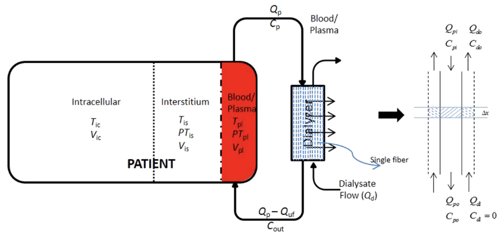
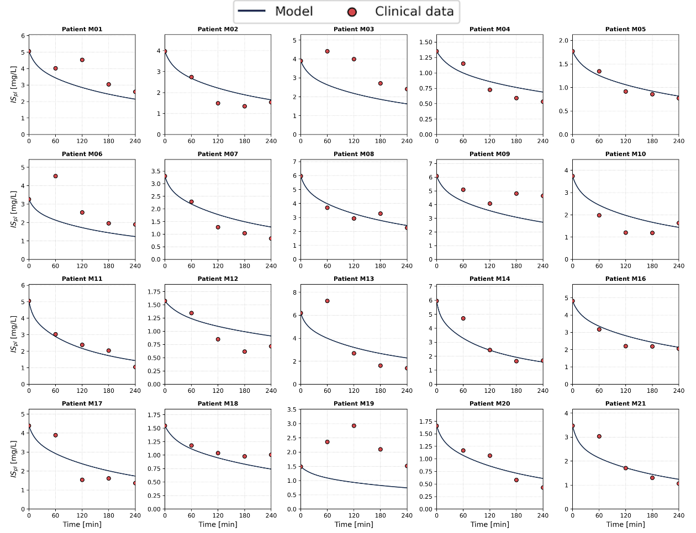
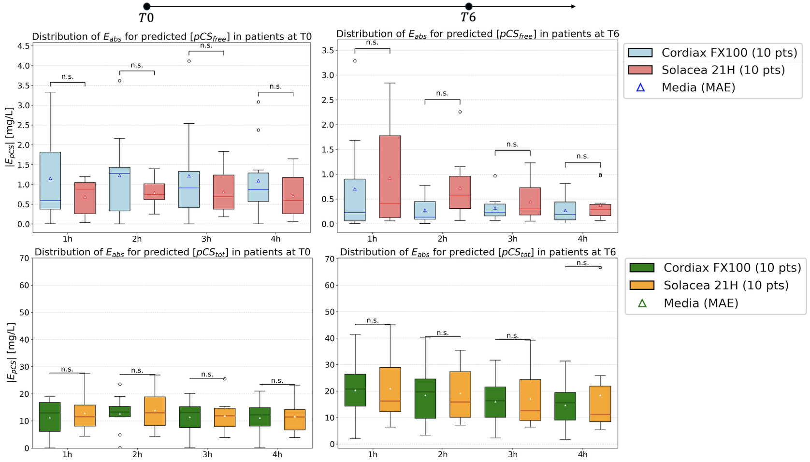
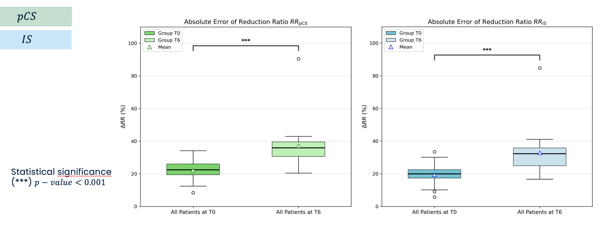
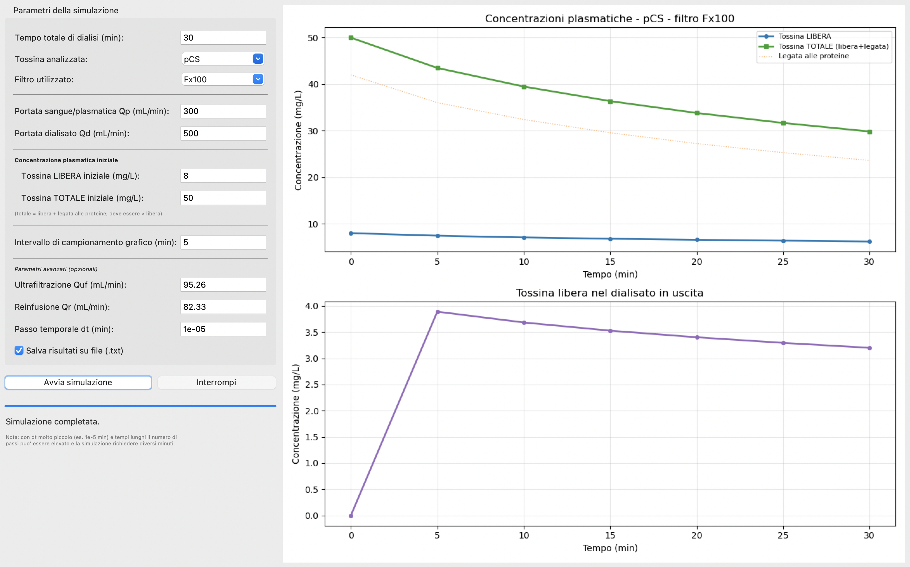

# Predictive_model_ol-HDF
Modello meccanicistico paziente-specifico per predire la cinetica di rimozione di determinate tossine (PBUTs) in trattamenti di emodialisi, specificatamente emodiafiltrazione Online.

## Overview

L'emodialisi rappresenta l'unica soluzione tampone in caso di **Chronic Kidney Disease (CKD)** in attesa di un trapianto renale. Sebbene sia un trattamento altamente efficiente nella rimozione di piccole tossine idrosolubili (come l'urea), la sua performance clinica è significativamente compromessa dalla scarsa clearance delle tossine legate alle proteine, le cosiddette **Protein-Bound Uremic Toxins (PBUTs)**.

Soluzioni innovative hanno visto l'avanzamento di terapie avanzate, come l'**emodiafiltrazione online (OL-HDF)**, che permettono una più elevata efficienza depurativa nei confronti delle PBUTs. Per caratterizzare meglio l'efficienza del trattamento e comprendere nel dettaglio la complessa cinetica di legame tra tossine e proteine, si adottano diversi approcci modellistici computazionali.

### Il Problema: Mancanza di Inter-variabilità

La letteratura attuale presenta prevalentemente modelli matematici basati su **parametri medi della popolazione**. Questo approccio limita drasticamente il potere predittivo a livello del **singolo paziente**, ignorando la fondamentale inter-variabilità biologica e clinica.

### La Soluzione: Approccio Patient-Specific

Questo progetto mira a superare questo limite sviluppando un **modello matematico meccanicistico patient-specific**. Il framework computazionale sviluppato tiene conto di:

1.  **Variabili specifiche del paziente:** Parametri clinici, fisiologici e biochimici individuali.
2.  **Parametri di setting della macchina da dialisi:** Condizioni operative reali del trattamento (flussi, tempi, etc.).
3.  **Specifiche di legame intrinseche delle tossine:** Modellazione dettagliata della cinetica di legame proteico per le tossine target analizzate in questo studio: **Indoxil Solfato (IS)** e **Para-Cresil Solfato (pCS)**.

### Il Modello Matematico e la Sua Implementazione

Il cuore tecnico di questo progetto è lo sviluppo di un modello cinetico avanzato. Questo modellizza due sistemi interconnessi tra loro: il **paziente**, rappresentato tramite un modello cinetico a **3 compartimenti** (intracellulare, interstiziale e plasmatico), e il **dializzatore**, modellato matematicamente in **1D**.

  
   
  <em>Figura 1: Schema del modello per la distribuzione e la rimozione delle tossine uremiche legate alle proteine ​​(PBUTs). In questo schema, T, PT e V indicano, rispettivamente, la concentrazione di tossina libera, la concentrazione di tossina legata alle proteine ​​e il volume di distribuzione nel compartimento indicato dal pedice.</em>

Il modello è stato parametrizzato utilizzando dati clinici reali provenienti da **20 pazienti** sottoposti a terapie OL-HDF. Per affrontare la "stiffness" (rigidezza) intrinseca del modello e consentire previsioni rapide dei risultati, sono stati valutati diversi schemi espliciti di integrazione numerica:
- Forward Euler method
- Runge Kutta methods (2nd order and 4th order)

### Risultati Principali e Impatto Clinico

Il modello personalizzato ha riprodotto accuratamente la cinetica delle PBUTs, mostrando un ottimo accordo con i dati clinici e bassi errori assoluti (<16 mg/L per le tossine totali e <0.8 mg/L per le frazioni libere).

  
   
  <em>Figura 2: Confronto tra i dati clinici reali (punti) e la simulazione del modello (linee) per un paziente specifico.</em>

Tra gli schemi di integrazione testati, il metodo **Runge-Kutta del secondo ordine** ha garantito la stabilità assoluta, riducendo i tempi di simulazione fino al **32%**.

### Valutazione Statistica dell'Accuratezza

Per valutare l'accuratezza predittiva del modello sono state condotte analisi statistiche approfondite sugli errori rispetto ai dati clinici. Nello specifico, sono state calcolate due metriche primarie:

1. **Errore assoluto sulle concentrazioni:** Valutato confrontando direttamente le traiettorie predette dal modello con i valori clinici registrati nei diversi punti temporali (ad 1h, 2h, 3h, 4h di trattamento dialitico).
2. **Errore assoluto sul Reduction Ratio percentuale (RR%):** Valutato per quantificare la precisione del modello nella stima dell'efficienza depurativa complessiva del trattamento.

Di seguito sono riportati i principali risultati ottenuti:

  
   
  <em>Figura 3: Distribuzione Errore assoluto a T0 e T6 per pCS libero (prima riga) e per pCS totale (seconda riga).</em>

  
   
  <em>Figura 4: Distribuzione Errore assoluto a T0 e T6 per RR%.</em>

#### Verso una Medicina di Precisione

Infine, per tradurre queste capacità computazionali in uno strumento clinico pratico, è stata implementata una **GUI user-friendly** che permette ai medici di utilizzare l'interfaccia con facilità. 

  
   
  <em>Figura 5: Interfaccia grafica (GUI) sviluppata in Python per l'utilizzo clinico.</em>

In futuro, questo framework può rappresentare un potente strumento predittivo a supporto del lavoro del medico, aiutando il paziente a ricevere il miglior trattamento possibile, realmente "cucito sulla sua persona" nell'ottica di una medicina di precisione.
